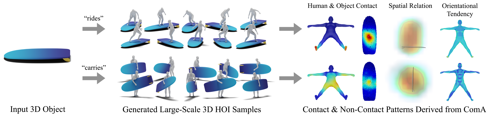

# <p align="center"> Beyond the Contact: Discovering Comprehensive Affordance for 3D Objects from Pre-trained 2D Diffusion Models (ECCV 2024)</p>

## [Project Page](https://snuvclab.github.io/coma/) &nbsp;|&nbsp; [Paper](https://snuvclab.github.io/coma/) 



This is the official code for the ECCV 2024 paper "Beyond the Contact: Discovering Comprehensive Affordance for 3D Objects from Pre-trained 2D Diffusion Models".

## News
- [2024/07/17] Initial dataset release.

## Download the Dataset

Since our pipeline for learning ComA is scalable with respect to the category of input objects, we collected a total of 83 object meshes from [SketchFab](https://sketchfab.com/), encompassing various interaction types. Each object mesh was converted to the `.obj` format, including image texture files. We manually canonicalize the location, orientation, and scale of the objects. The dataset can be downloaded at [Google Drive](https://drive.google.com/file/d/1wXvm4JEqE1IhwmeDECr8qYOH8hzOfIjx/view?usp=sharing).

The format of the dataset is as follows:

```
data
└── SketchFab
    ├── accordion # object category
    │   └── wx75e99elm1yhyfxz1efg60luadp95sl # object id
    │       ├── images # folder for texture files
    │       ├── model.obj
    │       └── model.mtl
    ├── axe
    ├── ...
    └── wine glass
```

In `SketchFab/categories.json`, you can check the existing object categories, along with the original data URL and the license information.