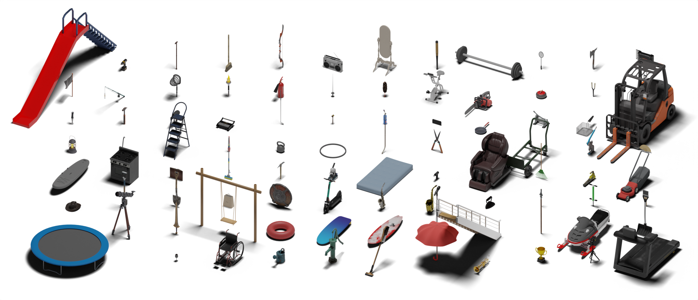

# <p align="center"> Beyond the Contact: Discovering Comprehensive Affordance for 3D Objects from Pre-trained 2D Diffusion Models (ECCV 2024, Oral)</p>

## [Project Page](https://snuvclab.github.io/coma/) &nbsp;|&nbsp; [Paper](https://arxiv.org/pdf/2401.12978) 


This is the official code for the ECCV 2024 paper "Beyond the Contact: Discovering Comprehensive Affordance for 3D Objects from Pre-trained 2D Diffusion Models".

## News
- [2024/08/19] Initial code release.
- [2024/07/24] Arxiv paper release.
- [2024/07/17] Initial dataset release.

## Download the Dataset



Since our pipeline for learning ComA is scalable with respect to the category of input objects, we collected a total of 83 object meshes from [SketchFab](https://sketchfab.com/), encompassing various interaction types. Each object mesh was converted to the `.obj` format, including image texture files. We manually canonicalize the location, orientation, and scale of the objects. The dataset can be downloaded at [Google Drive](https://drive.google.com/file/d/1wXvm4JEqE1IhwmeDECr8qYOH8hzOfIjx/view?usp=sharing).

The format of the dataset is as follows:

```
data
└── SketchFab
    ├── accordion # object category
    │   └── wx75e99elm1yhyfxz1efg60luadp95sl # object id
    │       ├── images # folder for texture files
    │       ├── model.obj
    │       └── model.mtl
    ├── axe
    ├── ...
    └── wine glass
```

In `SketchFab/categories.json`, you can check the existing object categories, along with the original data URL and the license information.

## Installation

To setup the environment for running ComA, please refer to the instructions provided <a href="INSTALL.md">here</a>.

## Quick Start

### 2D HOI Image Generation

To generate 2D HOI Images of given 3D object (in this case, backpack), use following command.

```shell
bash scripts/generate_2d_hoi_images.sh --gpus 0 1 2 3 4 5 6 7 --dataset_type "BEHAVE" --supercategory "BEHAVE" --category "backpack"
```

### 3D HOI Sample Generation

To generate 3D HOI Samples from the generated 2D HOI Images (of the given 3D object, backpack), use following command.

```shell
bash scripts/generate_3d_hoi_samples.sh --gpus 0 1 2 3 4 5 6 7 --dataset_type "BEHAVE" --supercategory "BEHAVE" --category "backpack"
```

### ComA Extraction

To learn ComA from the generated 3D HOI Samples, use following command.

```shell
bash scripts/learn_coma.sh --IoU_threshold_min 0.7 --inlier_num_threshold_min 10 --supercategory "BEHAVE" --category "backpack" --dataset_type "BEHAVE"
```

Note that the keys in the dictionary in `constants/coma/qual.py`, `IoU_threshold_min` and `inlier_num_threshold_min` are hyperparameters that can affect the results.

### Visualize Results

#### Visualize Results via Blender


To visualize results via Blender (human contact, object contact, human orientational tendency), use following commands. Make sure you have a GUI on your machine.

```shell
blenderproc debug src/visualization/visualize_human.py --affordance_path [human affordance npy path] # human contact, human orientational tendency
blenderproc debug src/visualization/visualize_object.py --affordance_path [object affordance ply path] # object contact
```

Both [human affordance npy path] and [object affordance ply path] will be under the directory `results/coma/affordance/` after executing ComA extraction.

#### Visualize Results via Mayavi


To visualize results via Mayavi (human occupancy), use following commands.

```shell
python src/visualization/visualize_occupancy.py --asset_downsample_pth [downsampled object pickle path] --affordance_path [occupancy affordance npy path]
```

[downsampled object pickle path] will be under the directory `results/coma/asset_downsample/` after executing object downsampling (included in ComA Extraction bash file). [occupancy affordance npy path] will be under the directory `results/coma/affordance/` after executing ComA extraction.

## Inference (Reproduce Results)

We release pre-trained ComA for backpack object of BEHAVE. We use different configuration settings (defined at `constants/coma/qual.py`) for obtaining each of the results (e.g., human contact, object contact, human orientational tendency, human occupancy). Download pre-trained ComA from [Google Drive](https://drive.google.com/file/d/1ieLXd78U1zSeJ37s493QVaaND870yNrV/view?usp=sharing) and place it at main directory. The final directory should be as:

```
coma
└── pre-trained
    └── BEHAVE 
        └── backpack
            ├── human_contact
            │   ├── behave_asset_180.pickle
            │   ├── coma_backpack_human_contact.pickle # ComA
            │   └── smplx_star_downsampled_FULL.pickle
            ├── human_occupancy
            │   ├── behave_asset_180.pickle
            │   ├── coma_backpack_human_occupancy.pickle # ComA
            │   └── smplx_star_downsampled_FULL.pickle
            ├── human_orientational_tendency
            │   ├── behave_asset_180.pickle
            │   ├── coma_backpack_human_orientation.pickle # ComA
            │   └── smplx_star_downsampled_FULL.pickle
            └── object_contact
                ├── behave_asset_1500.pickle
                ├── coma_backpack_object_contact.pickle # ComA
                └── smplx_star_downsampled_1000.pickle
```

For the pre-trained ComA, use following command to visualize each affordances.

### Human Contact

```shell
python src/coma/inference.py --supercategory "BEHAVE" --category "backpack" --coma_path "pre-trained/BEHAVE/backpack/human_contact/coma_backpack_human_contact.pickle" --visualize_type "aggr-object-contact" --smplx_downsample_pth "pre-trained/BEHAVE/backpack/human_contact/smplx_star_downsampled_FULL.pickle" --asset_downsample_pth "pre-trained/BEHAVE/backpack/human_contact/behave_asset_180.pickle" --hyperparams_key "qual:backpack_human_contact"
blenderproc debug src/visualization/visualize_human.py --affordance_path "output/BEHAVE/backpack/human_contact.npy"
```

### Object Contact

```shell
python src/coma/inference.py --supercategory "BEHAVE" --category "backpack" --coma_path "pre-trained/BEHAVE/backpack/human_contact/coma_backpack_human_contact.pickle" --visualize_type "aggr-object-contact" --smplx_downsample_pth "pre-trained/BEHAVE/backpack/human_contact/smplx_star_downsampled_FULL.pickle" --asset_downsample_pth "pre-trained/BEHAVE/backpack/human_contact/behave_asset_180.pickle" --hyperparams_key "qual:backpack_human_contact"
blenderproc debug src/visualization/visualize_object.py --affordance_path "output/BEHAVE/backpack/object_contact.ply"
```

### Human Orientational Tendency
```shell
python src/coma/inference.py --supercategory "BEHAVE" --category "backpack" --coma_path "pre-trained/BEHAVE/backpack/human_orientational_tendency/coma_backpack_human_orientation.pickle" --visualize_type "orientation" --smplx_downsample_pth "pre-trained/BEHAVE/backpack/human_orientational_tendency/smplx_star_downsampled_FULL.pickle" --asset_downsample_pth "pre-trained/BEHAVE/backpack/human_orientational_tendency/behave_asset_180.pickle" --hyperparams_key "qual:backpack_orientation" 
blenderproc debug src/visualization/visualize_human.py --affordance_path "output/BEHAVE/backpack/orientational_tendency.npy"
```

### Human Occupancy

```shell
python src/coma/inference.py --supercategory "BEHAVE" --category "backpack" --coma_path "pre-trained/BEHAVE/backpack/human_occupancy/coma_backpack_human_occupancy.pickle" --visualize_type "occupancy" --smplx_downsample_pth "pre-trained/BEHAVE/backpack/human_occupancy/smplx_star_downsampled_FULL.pickle" --asset_downsample_pth "pre-trained/BEHAVE/backpack/human_occupancy/behave_asset_180.pickle" --hyperparams_key "qual:backpack_occupancy"
python src/visualization/visualize_occupancy.py --asset_downsample_pth "pre-trained/BEHAVE/backpack/human_occupancy/behave_asset_180.pickle" --affordance_path "output/BEHAVE/backpack/occupancy.npy"
```

### (Optional) Application

We release code for our optimization framework to reconstruct Human-Object Interaction. You can optimize human via following command.

```shell
python src/application/optimize.py  --coma_path "pre-trained/BEHAVE/backpack/human_contact/coma_backpack_human_contact.pickle" --asset_downsample_pth "pre-trained/BEHAVE/backpack/human_contact/behave_asset_180.pickle" --use_collision
```

## Citation
If you find our work helpful or use our code, please consider citing:
```bibtex
@misc{coma,
      title={Beyond the Contact: Discovering Comprehensive Affordance for 3D Objects from Pre-trained 2D Diffusion Models}, 
      author={Hyeonwoo Kim and Sookwan Han and Patrick Kwon and Hanbyul Joo},
      year={2024},
      eprint={2401.12978},
      archivePrefix={arXiv},
      primaryClass={cs.CV},
      url={https://arxiv.org/abs/2401.12978}, 
}
```


## Acknowledgements
1. Our codebase builds heavily on 
    - <a href="https://github.com/jellyheadandrew/CHORUS">CHORUS</a>
    - <a href="https://github.com/vchoutas/smplx">SMPL/SMPL-X</a>
    - <a href="https://github.com/mks0601/Hand4Whole_RELEASE">Hand4Whole</a>
    - <a href="https://github.com/CompVis/stable-diffusion">Stable Diffusion</a>
    - <a href="https://github.com/facebookresearch/detectron2">Detectron2/PointRend</a>
    - <a href="https://github.com/nghorbani/human_body_prior">VPoser</a>
    - <a href="https://github.com/markomih/COAP">COAP</a>
    
    Thanks for open-sourcing!

2. We thank <a href="https://vi.kaist.ac.kr/project/hyeon-seong-kim/">Hyeonseong Kim</a> and <a href="https://bjkim95.github.io/">Byungjun Kim</a> for valuable comments!


## License
This work is licensed under a <a href="https://creativecommons.org/licenses/by-nc-sa/4.0/">Creative Commons Attribution-NonCommercial-ShareAlike 4.0 International License</a>. However, please note that our code depends on other libraries (e.g., <a href="https://smpl.is.tue.mpg.de/">SMPL</a>), which each have their own respective licenses that must also be followed.